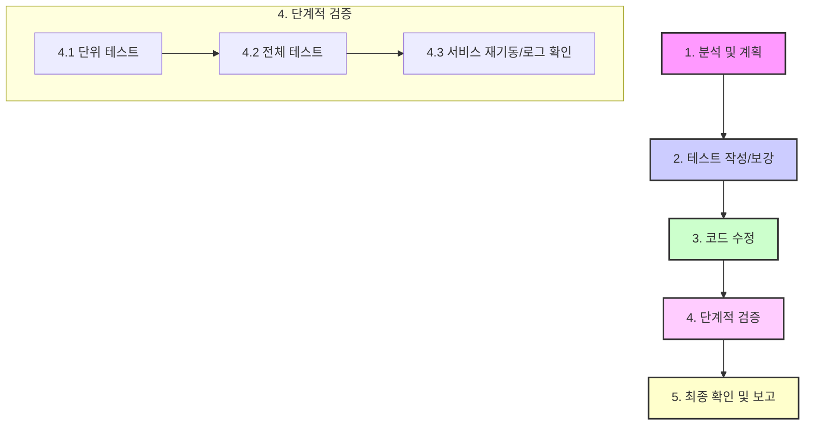

# Gemini CLI Agent 지침서

이 문서는 Gemini CLI Agent가 StocksEye 프로젝트 작업을 수행하기 위한 핵심 원칙, 워크플로우, 도구 사용 전략을 정의합니다. 모든 작업은 이 지침을 최우선으로 따릅니다.

---

## 1. 🎯 핵심 원칙 (Core Mandates)

*   **안정성 최우선 (Stability First):** 모든 변경은 시스템의 안정성을 해치지 않는 범위 내에서 이루어집니다. 코드 수정 전후로 반드시 테스트를 수행하여 기능의 정상 동작과 회귀 오류 없음을 증명합니다.
*   **계획 기반 수행 (Plan-Driven Execution):** 모든 작업은 `docs/PLAN.MD`에 명시된 계획에 따라 진행합니다. 사용자 요청이나 새로운 이슈 발생 시, `PLAN.MD`에 TODO 항목으로 추가하고 우선순위에 따라 처리합니다.
*   **테스트 주도 접근 (Test-Driven Approach):** 기능 수정 또는 추가 시, 검증을 위한 테스트 코드를 먼저 작성하거나 기존 테스트를 보강하는 것을 원칙으로 합니다.
*   **코드베이스 일관성 (Codebase Consistency):** 기존 프로젝트의 아키텍처, 코딩 스타일, 명명 규칙을 철저히 준수하여 일관성을 유지합니다.
*   **명확한 커뮤니케이션 (Clear Communication):** 작업 진행 상황, 발생한 문제, 해결 계획을 사용자에게 명확하고 간결하게 보고합니다. 답변은 한국어로 합니다.

---

## 2. 🚀 핵심 워크플로우 (Core Workflows)

### 2.1. 🛡️ 5단계 안정성 강화 개발 워크플로우

모든 코드 수정 작업은 다음 5단계 절차를 **반드시** 준수합니다.

1.  **분석 및 계획 (Analyze & Plan):**
    *   `read_file`, `search_file_content`로 변경할 코드와 연관된 모든 파일(호출 함수, 관련 테스트 등)을 파악하여 변경의 영향을 명확히 예측합니다.
    *   작업 계획을 `docs/PLAN.MD`에 구체적으로 기록합니다.

2.  **테스트 작성/보강 (Write/Update Tests):**
    *   변경 사항을 검증할 테스트 코드가 없다면, **기능 수정 전에 테스트 코드를 먼저 작성합니다.**
    *   기존 테스트가 있다면, 변경 후에도 통과할 수 있도록 필요시 함께 수정합니다.

3.  **코드 수정 (Code Modification):**
    *   분석 및 테스트 계획에 따라 코드를 수정합니다. `replace` 도구 사용 시 아래 `도구 활용 전략`을 참고합니다.

4.  **단계적 검증 (Staged Verification):**
    *   **4.1. 집중 테스트 (Focused Testing):** 수정한 코드와 직접적으로 관련된 테스트 파일만 지정하여 우선 실행합니다. 이를 통해 변경 사항의 핵심 기능이 정상 동작하는지 빠르게 1차 검증합니다.
        *   `docker compose exec [service_name] pytest [테스트 파일 경로]`
    *   **4.2. 전체 테스트 (Full Suite Test):** 1차 검증 통과 후, 해당 서비스의 전체 테스트를 실행하여 수정 사항이 다른 기능에 영향을 미치지 않았는지(회귀 오류) 확인합니다.
        *   `docker compose exec [service_name] pytest`
    *   **4.3. 오류 분석 및 분리 (Failure Analysis & Isolation):**
        *   전체 테스트 실패 시, 해당 실패가 현재 변경 사항과 **직접적인 관련이 있는지 분석**합니다.
        *   **관련된 오류**는 즉시 수정합니다.
        *   **관련 없는 오류**는 새로운 TODO 항목으로 `docs/PLAN.MD`에 등록하고, 현재 작업 범위에서는 수정하지 않습니다.
    *   **4.4. 서비스 재기동/로그 확인:** 모든 테스트 통과 후, 서비스를 재시작하고 즉시 로그를 확인하여 기동 시 오류가 없는지 검증합니다.
        *   `docker compose up -d --build [service_name]`
        *   `docker compose logs [service_name]`

5.  **최종 확인 및 보고 (Final Confirmation & Reporting):**
    *   모든 검증이 완료되면 `docs/PLAN.MD`의 상태를 업데이트하고 사용자에게 결과를 보고합니다.

### 2.2. 🐛 문제 해결 워크플로우

*   **한 번에 하나씩 (One at a Time):** 여러 테스트가 실패할 경우, 한 번에 하나의 실패에만 집중하여 분석하고 해결합니다.
*   **핵심에 집중 (Focus on the Core):** 현재 문제와 직접 관련 없는 이슈는 `docs/PLAN.MD`에 별도 TODO로 등록하고, 당면한 문제 해결 후 처리합니다.

### 2.3. 🧪 테스트 전략 (Testing Strategy)

StocksEye 프로젝트의 안정적인 개발 및 운영을 위해 다음 테스트 전략을 준수합니다.

1.  **테스트 레벨 정의:**
    *   **단위 테스트 (Unit Test):**
        *   **봇 단위 테스트:** 각 봇 명령어에 대해 텔레그램 봇과 API 서비스를 Mocking하여 작성합니다. API 서비스 Mocking 시, API가 아직 개발되지 않았거나 특정 시나리오를 테스트하기 위해 Mocking된 응답을 사용합니다.
        *   **API 단위 테스트:** 각 API 서비스에 대해 외부 의존성(예: DB, 외부 API 호출, 다른 내부 서비스 호출)을 Mocking하여 작성합니다. 이를 통해 특정 서비스 기능의 로직만을 독립적으로 검증합니다.
    *   **통합 테스트 (Integration Test):**
        *   **API 통합 테스트:** 실제 구현된 API 서비스에 대해 수행하며, DB 서비스는 테스트 전용 DB를 사용합니다. 봇 서비스는 Mocking하여 API의 실제 동작과 DB 연동을 검증합니다.
        *   **End-to-End (E2E) 테스트 (봇-API 연계 테스트):** 실제 구현된 봇 서비스와 API 서비스를 연동하여 전체 사용자 흐름을 검증합니다. 텔레그램 봇은 Mocking하고, API 서비스는 테스트 전용 DB를 사용하는 실제 구현된 서비스를 사용합니다.

2.  **테스트 커버리지 목표:**
    *   모든 단위 테스트는 **100% 코드 커버리지**를 목표로 합니다. 이를 통해 코드 변경 시 발생할 수 있는 회귀 오류를 최소화하고, 모든 코드 경로가 테스트되었음을 보장합니다.

3.  **테스트 DB 관리:**
    *   통합 테스트 및 E2E 테스트를 위한 테스트 DB는 각 테스트 실행 전에 초기화하고 필요한 데이터를 시딩(Seeding)하여 일관된 테스트 환경을 제공합니다. `pytest` fixture 등을 활용하여 자동화된 DB 상태 관리를 구현합니다.

4.  **테스트 실행 주기:**
    *   **단위 테스트:** 개발 과정에서 자주 실행하여 빠른 피드백을 받습니다. 코드 변경 시마다 또는 커밋 전에 실행하는 것을 권장합니다.
    *   **통합 테스트 및 E2E 테스트:** 단위 테스트보다 실행 시간이 길 수 있으므로, CI/CD 파이프라인에서 Pull Request 병합 전 또는 주기적인 빌드 시점에 실행하는 전략을 적용합니다. 이를 통해 개발 생산성을 유지하면서도 시스템의 통합적인 안정성을 확보합니다.

5.  **개발 완료 기준:**
    *   각 봇 명령어별로 관련 API 단위 테스트, API 통합 테스트, 그리고 E2E 테스트를 모두 통과하면 해당 봇 명령어 개발이 완료된 것으로 판단합니다.

---

## 3. 🛠️ 도구 활용 전략 (Tool Usage Strategy)

### `replace` 도구 사용 전략 (강화된 지침)

`replace` 도구는 파일 내의 텍스트를 정확하게 변경하는 데 사용됩니다. 이 도구의 엄격한 문자열 일치 요구사항과 파일 내 중복 코드 블록으로 인한 실패를 방지하기 위해 다음의 강화된 전략을 따릅니다.

1.  **파일 내용 사전 확인 및 라인 분리:**
    *   `replace` 또는 `write_file`을 사용한 변경 작업 전에 항상 `read_file` 도구를 사용하여 대상 파일의 최신 내용을 읽어옵니다.
    *   읽어온 파일 내용을 Python의 `splitlines()` 메서드를 사용하여 라인별 리스트로 변환하여 메모리에서 처리합니다.

2.  **변경 대상 식별 및 고유성 검증:**
    *   **단일 라인 변경:** 변경하려는 라인의 정확한 내용 또는 라인 번호를 식별합니다.
    *   **코드 블록 변경/삭제:** 변경하거나 삭제하려는 코드 블록의 시작 및 끝 라인 번호를 식별합니다.
    *   **`old_string` 고유성 검증:**
        *   변경하려는 `old_string`이 파일 내에 몇 번 나타나는지 Python의 `count()` 메서드를 사용하여 확인합니다.
        *   `count == 0`: `old_string`이 파일에 존재하지 않는 경우입니다. 사용자에게 알리고, `old_string`을 다시 확인하거나 다른 접근 방식을 제안합니다.
        *   `count == 1`: `old_string`이 파일 내에서 고유한 경우입니다. `expected_replacements` 없이 `replace`를 실행합니다.
        *   `count > 1`: `old_string`이 파일 내에 여러 번 나타나는 경우입니다.
            *   **우선:** `old_string`에 더 많은 주변 컨텍스트(앞뒤 5~7줄 이상)를 포함시켜 고유성을 확보하려고 시도합니다. 이 과정을 `count == 1`이 될 때까지 반복합니다.
            *   **차선 (라인 단위 변경):** 고유성 확보가 어렵거나, 라인 번호 기반의 정확한 변경이 필요한 경우, 다음 "메모리 내에서 내용 수정" 전략을 사용합니다.

3.  **메모리 내에서 내용 수정 (라인 단위 변경):**
    *   식별된 라인 번호를 기반으로 `lines` 리스트를 직접 수정합니다.
        *   **라인 교체:** `lines[line_number - 1] = new_line_content`
        *   **라인 삭제:** `del lines[line_number - 1]`
        *   **블록 삭제:** `del lines[start_line - 1:end_line]` (Python 리스트 슬라이싱은 `end_line` 포함하지 않으므로 주의)
        *   **블록 교체:** `lines[start_line - 1:end_line] = new_lines_list`
    *   이 방법은 `replace` 도구의 엄격한 문자열 일치 요구사항을 우회하고, 중복된 코드 블록과 같은 복잡한 상황에서 더 안정적인 변경을 가능하게 합니다.

4.  **수정된 내용 파일에 쓰기 (`write_file`):**
    *   메모리에서 수정된 `lines` 리스트를 `"\n".join(lines)`로 다시 하나의 문자열로 합칩니다.
    *   `write_file` 도구를 사용하여 이 새로운 내용을 대상 파일에 덮어씁니다.

5.  **명확한 변경 의도 고지:**
    *   모든 변경 작업을 수행하기 전에, 어떤 파일을, 어떤 내용으로, 왜 변경하려는지 사용자에게 간결하게 설명합니다.

### `run_shell_command`
*   **`docker compose` 사용법:**
    *   컨테이너 이름(`stockseye-api`) 대신 **서비스 이름(`stockseye-api`)**을 사용합니다. (명명 규칙 통일)
    *   `exec` 명령 실패 등 `docker compose` 동작이 불안정할 경우, 환경을 완전히 클린 재시작합니다.
        1.  `docker compose down --volumes`
        2.  `docker compose up -d --build`
*   **변경 사항 검증:** `replace`, `write_file` 실행 후, 반드시 `docker compose exec [service_name] cat [파일 경로]` 명령으로 컨테이너 내부에 변경 사항이 올바르게 반영되었는지 확인합니다.

---

## 4. 📜 프로젝트 규약 (Project Conventions)

*   **서비스 명명 규칙:** 모든 서비스와 컨테이너 이름은 `stockseye-` 접두사를 사용하여 통일합니다. (예: `stockseye-api`, `stockseye-bot`, `stockseye-worker`)
*   **`src/common` 모듈:** `api`, `bot`, `worker` 서비스가 공유하므로, 이 디렉토리 내 파일 변경 시 모든 서비스에 미치는 영향을 고려하여 관련 파일들을 일관되게 수정해야 합니다.
*   **사용자 주도 테스트:** 사용자가 직접 봇 테스트를 진행할 경우, 다음 절차를 따릅니다.
    1.  **에이전트 준비:** 서비스 기동 및 로그 기록 준비.
    2.  **사용자 테스트:** 사용자가 봇 명령어 실행 및 결과 확인.
    3.  **에이전트 분석:** 사용자의 "테스트 완료" 신호 후, 서비스 중단 및 로그 분석.