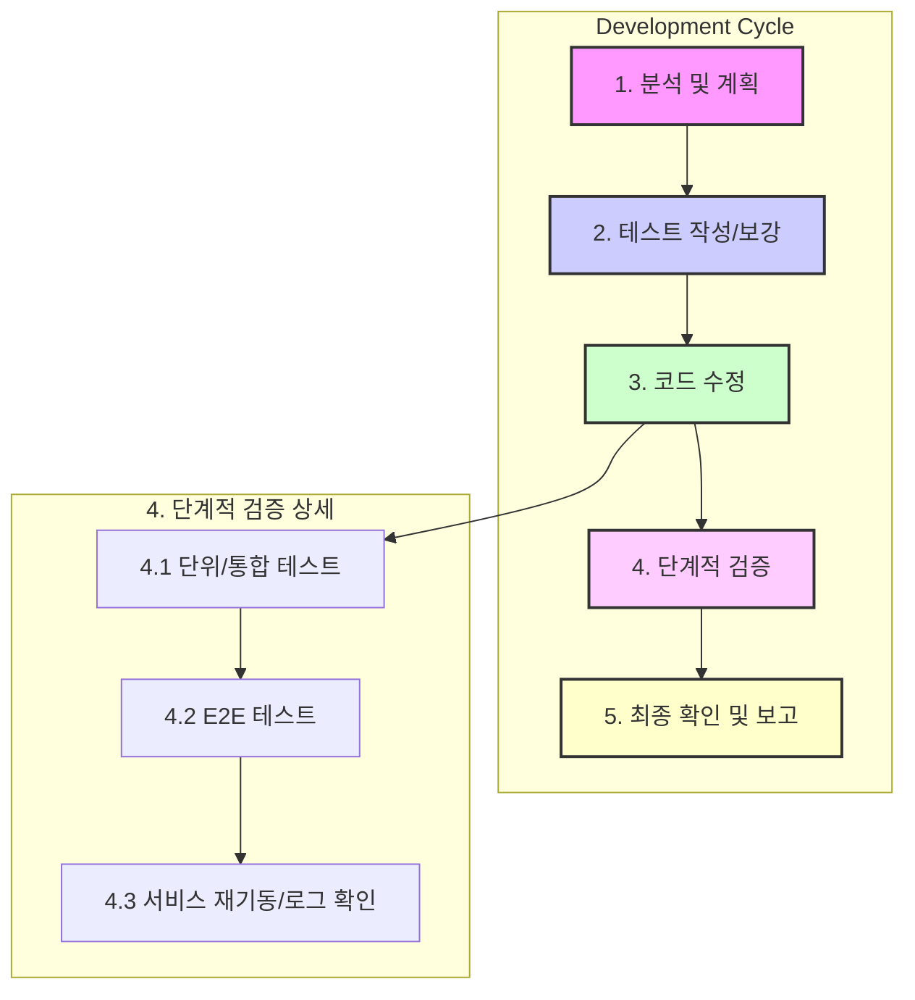

# Gemini CLI Agent 지침서

이 문서는 Gemini CLI Agent가 프로젝트 작업을 수행하기 위한 핵심 원칙, 워크플로우, 도구 사용 전략을 정의합니다. 모든 작업은 이 지침을 최우선으로 따릅니다.

---

## 1. 🎯 핵심 원칙 (Core Mandates)

*   **안정성 최우선 (Stability First):** 모든 변경은 시스템 안정성을 최우선으로 고려합니다. **코드 수정 전후 반드시 테스트를 수행**하여 기능의 정상 동작과 회귀 오류 없음을 증명합니다.
*   **계획 기반 수행 (Plan-Driven Execution):** 모든 작업은 `TODO.md`에 명시된 계획에 따라 진행합니다. 사용자 요청이나 새로운 이슈 발생 시, `TODO.md`에 TODO 항목으로 추가하고 우선순위에 따라 처리합니다.
*   **테스트 주도 접근 (Test-Driven Approach):** 기능 수정 또는 추가 시, **검증을 위한 테스트 코드를 먼저 작성하거나 기존 테스트를 보강**하는 것을 원칙으로 합니다.
*   **코드베이스 일관성 (Codebase Consistency):** 기존 프로젝트의 아키텍처, 코딩 스타일, 명명 규칙을 철저히 준수하여 일관성을 유지합니다.
*   **명확한 커뮤니케이션 (Clear Communication):** 작업 진행 상황, 발생한 문제, 해결 계획을 사용자에게 명확하고 간결하게 보고합니다. **답변은 한국어로 합니다.**

---

## 2. 🚀 핵심 워크플로우 (Core Workflows)

### 2.1. 🛡️ 5단계 안정성 강화 개발 워크플로우

모든 코드 수정 작업은 다음 5단계 절차를 **반드시** 준수합니다.

1.  **분석 및 계획 (Analyze & Plan):**
    *   `read_file`, `search_file_content`로 변경할 코드와 연관된 모든 파일(호출 함수, 관련 테스트 등)을 파악하여 변경의 영향을 명확히 예측합니다.
    *   작업 계획을 `TODO.md`에 구체적으로 기록합니다.

2.  **테스트 작성/보강 (Write/Update Tests):**
    *   변경 사항을 검증할 테스트 코드가 없다면, **기능 수정 전에 테스트 코드를 먼저 작성합니다.**
    *   기존 테스트가 있다면, 변경 후에도 통과할 수 있도록 필요시 함께 수정합니다.

3.  **코드 수정 (Code Modification):**
    *   분석 및 테스트 계획에 따라 코드를 수정합니다.

4.  **단계적 검증 (Staged Verification):**
    *   **4.1. 집중 테스트 (Focused Testing):** 수정한 코드와 직접적으로 관련된 단위/통합 테스트만 지정하여 우선 실행합니다. (`docker compose exec [service_name] pytest [테스트 파일 경로]`)
    *   **4.2. 전체 테스트 (Full Suite Test):** 1차 검증 통과 후, 해당 서비스의 전체 테스트 및 E2E 테스트를 실행하여 수정 사항이 다른 기능에 영향을 미치지 않았는지(회귀 오류) 확인합니다.
    *   **4.3. 서비스 재기동/로그 확인:** 모든 테스트 통과 후, 서비스를 재시작하고 즉시 로그를 확인하여 기동 시 오류가 없는지 검증합니다. (`docker compose up -d --build [service_name]` -> `docker compose logs [service_name]`)

5.  **최종 확인 및 보고 (Final Confirmation & Reporting):**
    *   모든 검증이 완료되면 `TODO.md`의 상태를 업데이트하고 사용자에게 결과를 보고합니다.
    *   진행상황을 `docs/worklogs` 폴더에 날짜별로 추가하여, 다른 사람이 현재 상황과 다음 진행 상황을 파악할 수 있도록 합니다.

### 2.2. 🐛 문제 해결 워크플로우

*   **한 번에 하나씩 (One at a Time):** 여러 테스트가 실패할 경우, 한 번에 하나의 실패에만 집중하여 분석하고 해결합니다.
*   **핵심에 집중 (Focus on the Core):** 현재 문제와 직접 관련 없는 이슈는 `TODO.md`에 별도 TODO로 등록하고, 당면한 문제 해결 후 처리합니다.
*   **`ConversationHandler` 상태 확인:** 특정 핸들러가 예상대로 동작하지 않을 경우, **다른 `ConversationHandler`가 대화 상태를 선점하여 메시지를 가로채고 있는지 의심**하고 확인합니다. (`/cancel` 명령어로 상태 초기화를 시도하여 문제를 진단합니다.)

### 2.3. 🧪 테스트 전략 (Testing Strategy)

*   **테스트 레벨:** 단위(Unit), 통합(Integration), E2E(End-to-End) 테스트를 모두 활용하여 코드의 안정성을 다각도로 검증합니다.
*   **테스트 커버리지:** 모든 단위 테스트는 **100% 코드 커버리지**를 목표로 하여 회귀 오류를 최소화합니다.
*   **테스트 DB 관리:** 통합 및 E2E 테스트는 `pytest` fixture 등을 활용하여 **매번 초기화된 DB 환경**에서 수행하여 일관성을 보장합니다.
*   **개발 완료 기준:** 각 기능은 관련된 단위, 통합, E2E 테스트를 **모두 통과**하면 개발이 완료된 것으로 간주합니다.

---

## 3. 🛠️ 도구 활용 전략 (Tool Usage Strategy)

*   **파일 수정 원칙:**
    *   **`write_file` 사용:** 소스 코드나 문서를 수정할 때는 **절대 `replace`를 사용하지 않습니다.**
    *   **수정 절차:** ① `read_file`로 전체 내용을 읽고, ② 메모리에서 내용을 수정한 뒤, ③ `write_file`로 전체 내용을 다시 쓰는 방식을 반드시 준수합니다.
    *   **변경 사항 검증:** `write_file` 실행 후, `docker compose exec [service_name] cat [파일 경로]` 명령으로 컨테이너 내부에 변경 사항이 올바르게 반영되었는지 확인합니다.

*   **`run_shell_command` 사용법:**
    *   **서비스 이름 사용:** 컨테이너 이름(`stockeye-api-1`) 대신 **서비스 이름(`stockeye-api`)**을 사용합니다.
    *   **클린 재시작:** 동작이 불안정할 경우, 다음 명령어로 환경을 완전히 재시작합니다.
        1.  `docker compose down --volumes`
        2.  `sudo rm -rf ./db/* ./logs/*`
        3.  `docker compose up -d --build`

---

## 4. 📜 프로젝트 규약 (Project Conventions)

*   **서비스 명명 규칙:** 모든 서비스와 컨테이너 이름은 `stockeye-` 접두사를 사용합니다. (예: `stockeye-api`, `stockeye-bot`)
*   **`src/common` 모듈:** `api`, `bot`, `worker` 서비스가 공유하므로, 이 디렉토리 내 파일 변경 시 **모든 서비스에 미치는 영향을 고려**하여 관련 파일들을 일관되게 수정해야 합니다.
*   **`src/common` 모듈 테스트:** `common` 모듈은 독립적인 환경에서 테스트를 수행해야 합니다.
    1.  **테스트 이미지 빌드:** `docker build -t stockeye-common-test -f src/common/Dockerfile.test .`
    2.  **테스트 실행:** `docker run --rm stockeye-common-test`
*   **파일 크기 관리:** 모든 소스 파일의 길이는 **250 라인을 넘지 않도록 관리**하는 것을 원칙으로 합니다. 250 라인을 초과하는 파일은 즉시 논리적인 단위로 분리하는 리팩토링을 진행합니다.
