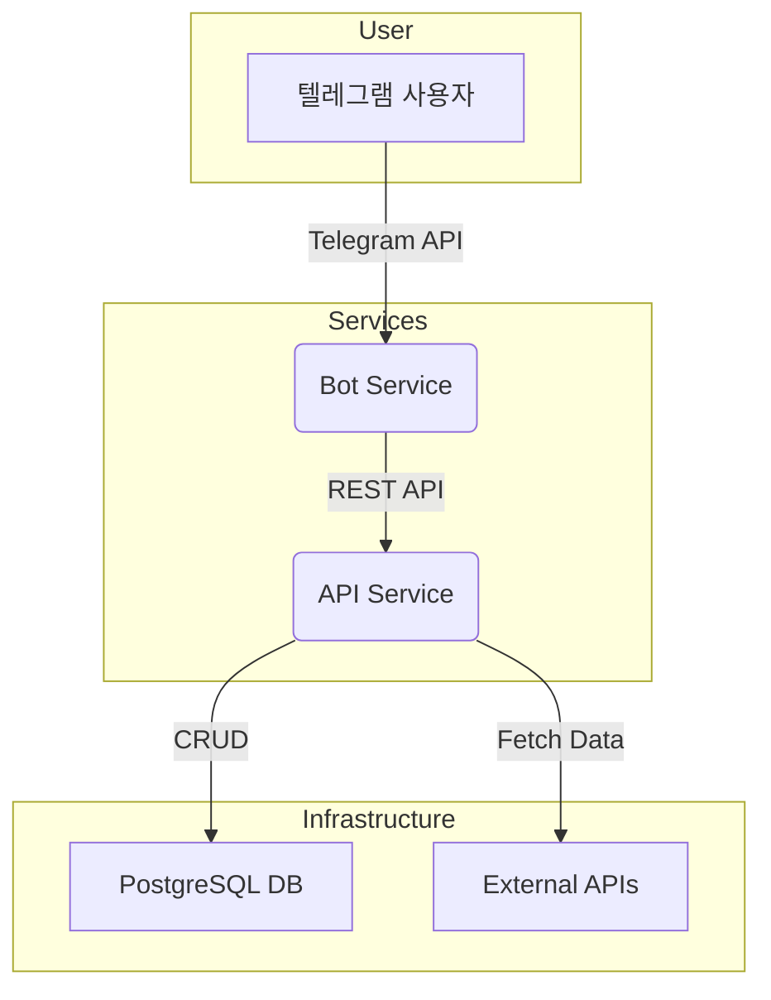
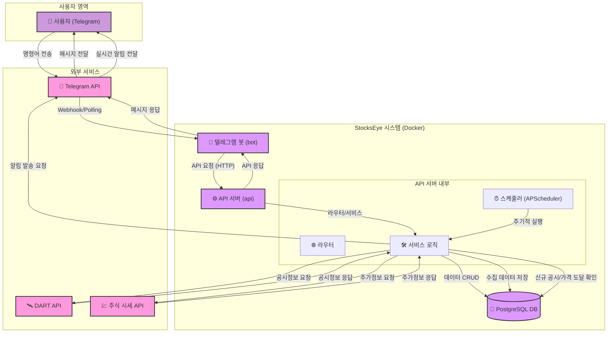

# StocksEye 프로젝트 개요

## 1. 프로젝트 목표

기존에 분산되어 있던 주식 관련 프로젝트(StockEye, StockBuySell, LetsGetRich)의 핵심 기능들을 단일 서비스로 통합하여, 사용자에게는 일관된 주식 정보 및 거래 경험을 제공하고 개발 및 운영의 효율성을 극대화하는 것을 목표로 합니다.

## 2. 시스템 아키텍처

StocksEye는 다음과 같은 두 개의 주요 서비스로 구성된 MSA(Microservice Architecture)를 따릅니다.

- **API 서비스 (`src/api`):** FastAPI 기반의 RESTful API 서버입니다. 데이터베이스와 연동하여 핵심 비즈니스 로직(사용자 인증, 주식 데이터 관리, 예측, 모의 거래 등)을 처리하고, 봇 서비스에 필요한 모든 데이터를 제공합니다.
- **Bot 서비스 (`src/bot`):** `python-telegram-bot` 기반의 텔레그램 챗봇입니다. 사용자와의 상호작용을 담당하며, API 서비스를 호출하여 사용자의 요청을 처리하고 결과를 메시지로 전달합니다.

두 서비스는 Docker 컨테이너로 패키징되어 `docker-compose.yml`을 통해 관리되며, 데이터는 PostgreSQL 데이터베이스에 영속적으로 저장됩니다.



## 3. 핵심 기능 명세

| 기능 분류 | 상세 기능 |
| :--- | :--- |
| **사용자 관리** | - JWT 기반 회원가입, 로그인, 인증<br>- 텔레그램 계정 연동<br>- 사용자 정보 조회 및 관리 |
| **주식 정보** | - **종목 마스터**: 국내 주식 종목 정보 일괄 관리 (매일 자동 갱신)<br>- **일별 시세**: `yfinance`를 이용한 실제 주식 시세(OHLCV) 데이터 관리 (매일 자동 갱신)<br>- **공시 정보**: DART API를 통한 최신 공시 정보 조회 및 실시간 알림 |
| **핵심 사용자 기능** | - **주가 예측**: 기술적 지표(SMA, RSI, MACD) 기반 주가 등락 예측 및 신뢰도 제공<br>- **관심 종목**: 관심 종목 추가/삭제/조회<br>- **가격 알림**: 목표 가격 도달, 변동률 조건 충족 시 텔레그램 알림<br>- **모의 거래**: 가상 매수/매도 및 수익률, 거래 내역 조회 |
| **관리자 기능** | - 텔레그램 봇 명령어를 통한 시스템 통계 조회<br>- 데이터 수동 갱신 (종목 마스터, 일별 시세, 공시 정보)<br>- 백그라운드 스케줄러 상태 조회 및 수동 실행 |

## 4. 폴더 구조

```
├── src/
│   ├── api/           # FastAPI 기반 API 서비스
│   │   ├── main.py      # FastAPI 앱 초기화, 스케줄러 설정
│   │   ├── models/      # SQLAlchemy DB 모델
│   │   ├── routers/     # API 엔드포인트별 라우터
│   │   ├── services/    # 핵심 비즈니스 로직
│   │   ├── schemas/     # Pydantic 데이터 검증 스키마
│   │   └── tests/       # API 서비스 테스트 코드
│   ├── bot/           # 텔레그램 챗봇 서비스
│   │   ├── main.py      # 텔레그램 봇 앱 초기화
│   │   ├── handlers/    # 챗봇 명령어/메시지 핸들러
│   │   └── tests/       # 봇 서비스 테스트 코드
│   └── common/        # 두 서비스가 공유하는 공통 모듈
├── docs/              # 프로젝트 문서
├── logs/              # 서비스 운영 로그
├── .env.development   # 개발 환경 변수 파일
├── .env.production    # 운영 환경 변수 파일
├── docker-compose.yml # Docker 서비스 통합 관리
└── README.md          # 프로젝트 개요 및 안내
```

## 5. 시스템 구성도

