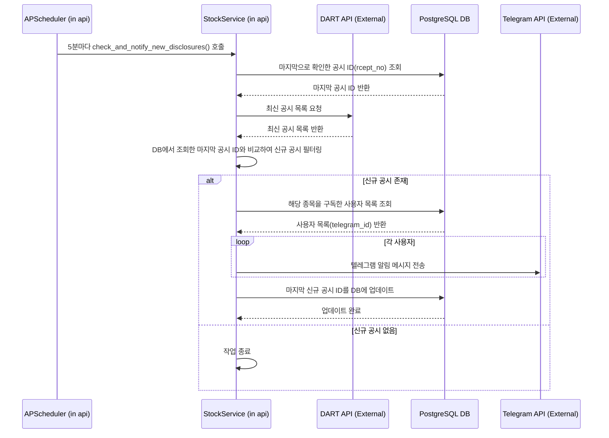

# 실시간 공시 알림 기능

## 1. 개요

DART 공시 API를 주기적으로 확인하여 새로운 공시가 올라오면, 관련 정보를 구독한 사용자에게 텔레그램으로 실시간 알림을 보내는 기능입니다.

## 2. 아키텍처 및 흐름

## 3. 핵심 구현 내용

### 3.1. 주기적 실행 (Polling)

-   `api` 서비스의 `APScheduler`를 사용하여 `stock_service.check_and_notify_new_disclosures` 함수를 60분 간격으로 주기적으로 실행합니다.

### 3.2. 중복 알림 방지

-   서버가 재시작되어도 마지막으로 확인한 공시를 기억하기 위해, `system_config` 테이블을 사용합니다.
-   `key`가 `last_checked_rcept_no`인 값에 마지막으로 처리한 공시의 접수번호를 저장하고, 다음 실행 시 이 번호보다 최신인 공시만 처리합니다.
-   **테이블 모델:** `src/api/models/system_config.py`

### 3.3. 예외 처리 강화

-   **`DartApiError` 사용자 정의 예외:** DART API 통신 중 발생하는 오류(네트워크, API 응답 오류 등)를 명확하게 처리하기 위해 사용자 정의 예외 클래스를 도입했습니다. (`src/common/exceptions.py`)
-   **오류 상황별 처리:** API 사용량 초과(`status: 020`)와 같은 특정 오류 발생 시, `CRITICAL` 레벨의 로그를 남기고 작업을 안전하게 중단하여 서비스 안정성을 높였습니다.

### 3.4. 테스트 엔드포인트

-   스케줄러 주기를 기다리지 않고 기능을 즉시 테스트할 수 있도록 다음 엔드포인트를 추가했습니다.
    -   `POST /admin/trigger/check_disclosures`

## 4. 관련 파일

-   **핵심 로직:** `src/api/services/stock_service.py`
-   **API 통신:** `src/common/dart_utils.py`
-   **스케줄러 및 라우터:** `src/api/main.py`, `src/api/routers/admin.py`
-   **DB 모델:** `src/api/models/system_config.py`
-   **예외 클래스:** `src/common/exceptions.py` 