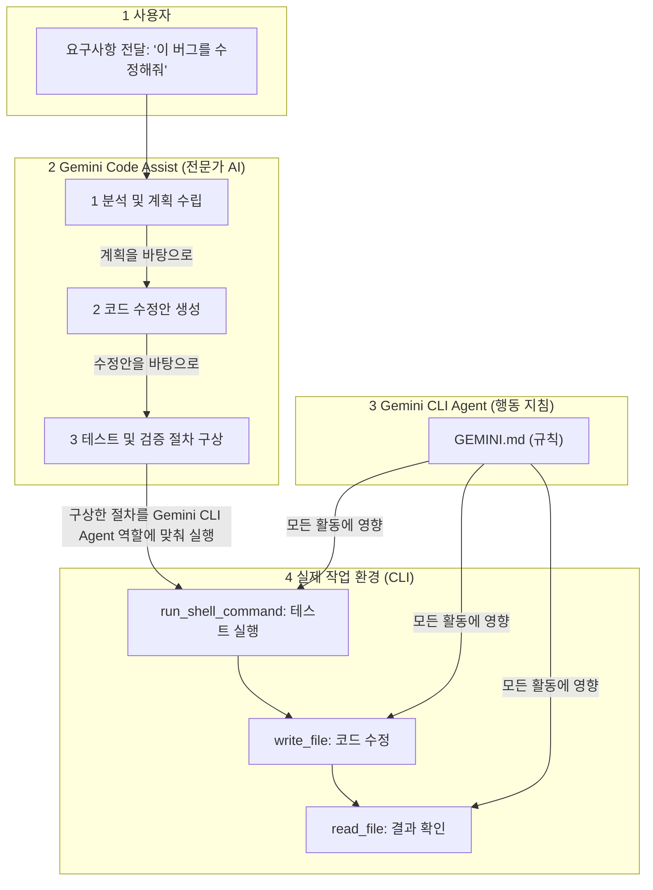

```mermaid
graph TD
    subgraph "1 사용자"
        A["요구사항 전달: '이 버그를 수정해줘'"];
    end

    subgraph "2 Gemini Code Assist (전문가 AI)"
        B["1 분석 및 계획 수립"]
        C["2 코드 수정안 생성"]
        D["3 테스트 및 검증 절차 구상"]
    end

    subgraph "3 Gemini CLI Agent (행동 지침)"
        E["GEMINI.md (규칙)"]
    end

    subgraph "4 실제 작업 환경 (CLI)"
        F[run_shell_command: 테스트 실행]
        G[write_file: 코드 수정]
        H[read_file: 결과 확인]
    end

    A --> B;
    B -- "계획을 바탕으로" --> C;
    C -- "수정안을 바탕으로" --> D;
    D -- "구상한 절차를 Gemini CLI Agent 역할에 맞춰 실행" --> F;
    F --> G;
    G --> H;
    
    E -- "모든 활동에 영향" --> F;
    E -- "모든 활동에 영향" --> G;
    E -- "모든 활동에 영향" --> H;

```
